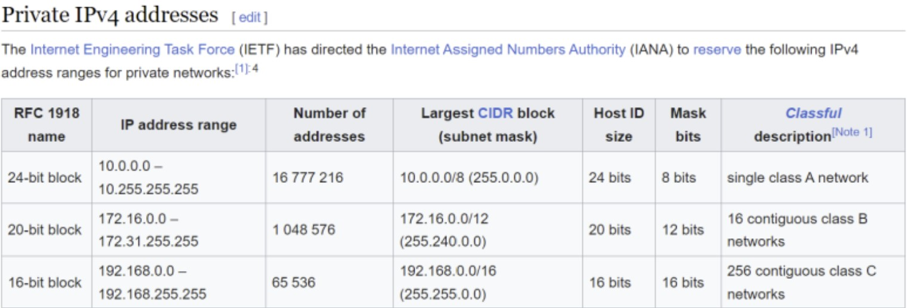
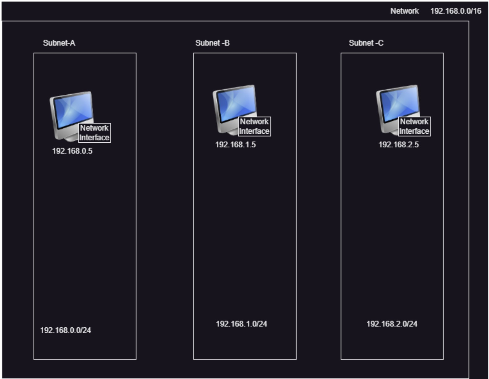
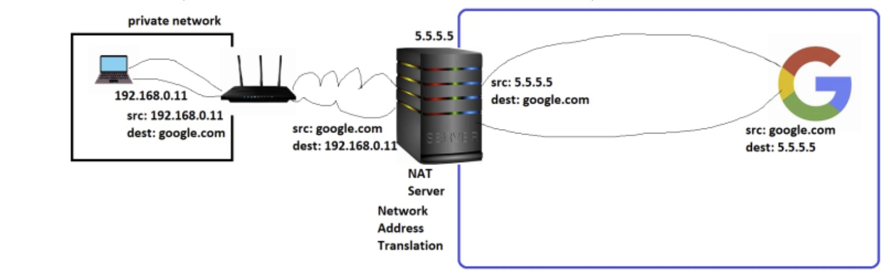
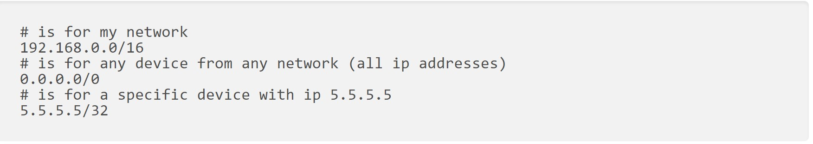
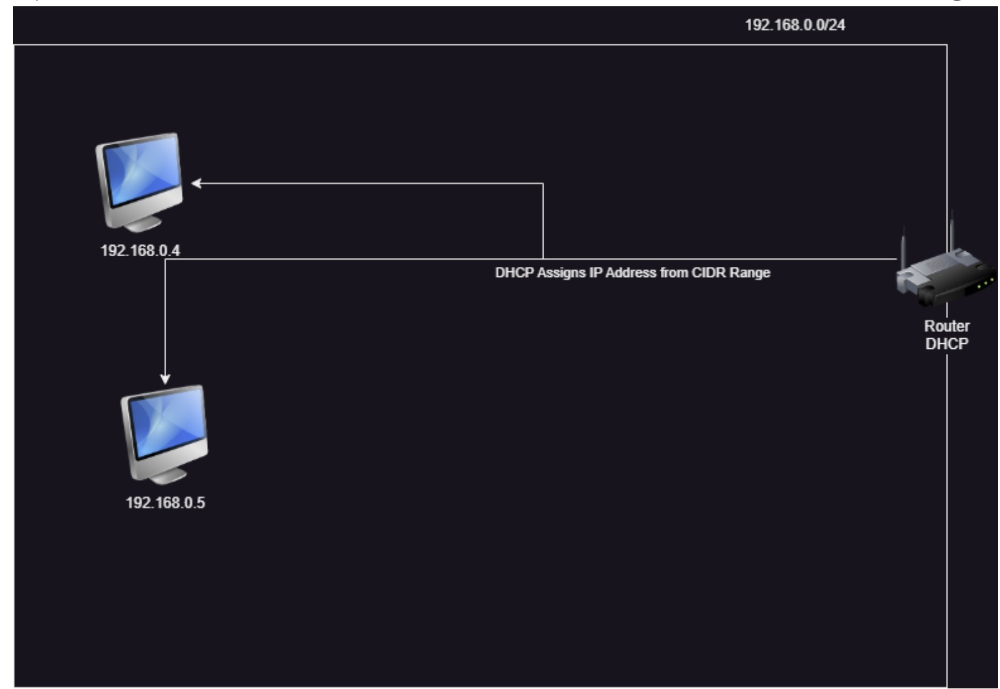
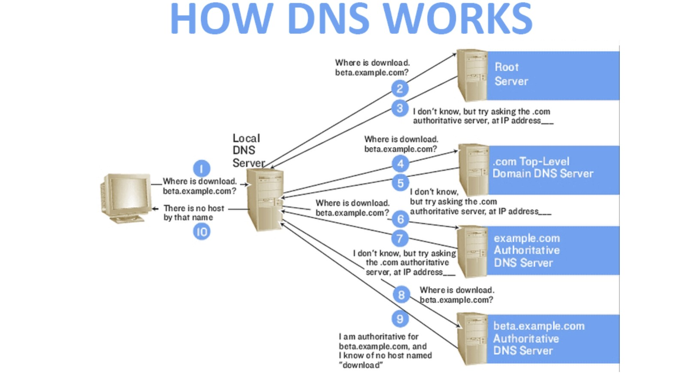

# Private Network vs Public Network
* Public Network: A network which can be accessed from internet
* Private Network: A network which cannot be accessed directly from internet.
* For private networks there are some predefined or reserved cidr ranges

# Networking

* When a device is connected to the network, ip is assigned to the network interface, which is used to access the device.

* If a system has multiple network interfaces we can have multiple ip addresses to the system

## How can a private network get internet access?
* Rule: Any server which is accessed on open internet expects to send direct response
* NAT Server (Network Address Translation):

* NAT Server will be present in public network with a route from private network. when the packet travels through NAT, it does address translations.

## Router
* Router forwards packets from one network to another
* Each Router will have Route table which are rules to forward the packets
* Rules are written in terms of CIDR Ranges
* Rules generally work only on network ids*


## DHCP (Dynamic Host Configuration Protocol): 
* DHCP server is responsible for assigning an ip address to the device connected to a network. DHCP can assign static ip to a device or a dynamic from free ip addresses available in network cidr range.


## DNS Server:
* Networking protocols work with ip addresses, but ip addresses are not human friendly.
    * DNS(Domain Name Server) is about mapping a name and other information to an ip
    * DNS contains Records and [Refer Here](https://www.site24x7.com/learn/dns-record-types.html) for record types. Lets focus on two record types A (Domain name to ip) and CNAME (alias to a domain)
    * DNS can be configured at client machine
            * windows C:\windows\system32\drivers\etc\hosts
            * *nix /etc/hosts
    * DNS can be configured at server end as well
           *  public DNS
            * internal DNS
    * Public DNS:
            * We would have a DNS Zone where we will maintain the records of DNS Server
            

## Communication between two private networks
* When you want to communicate between two private network CIDR Ranges should not be colliding
```
Case A:
Network A: 192.168.0.0/24 => 192.168.0.0 to 192.168.0.255
Network B: 192.168.1.0/24 => 192.168.1.0 to 192.168.1 255
Not colliding

Case B:
Network A: 192.168.0.0/24 => 192.168.0.0 to 192.168.0.255
Network B: 192.168.0.0/23 => 192.168.0.0 to 192.168.1.255
Colliding
```