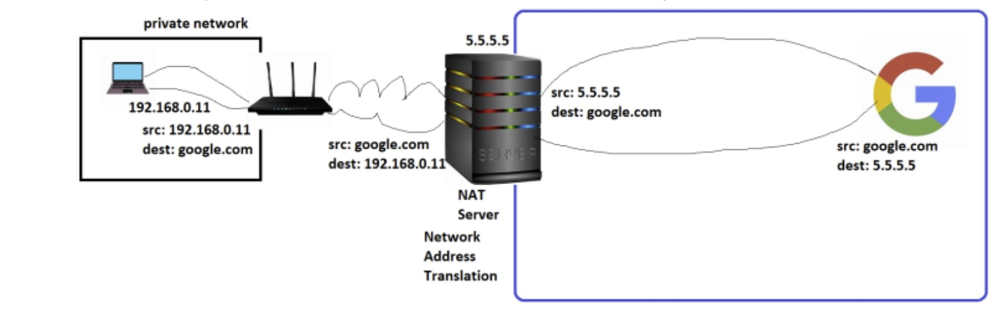

# Private Network vs Public Network
* Public Network: A network which can be accessed from internet
* Private Network: A network which cannot be accessed directly from internet.
* For private networks there are some predefined or reserved cidr ranges

# Networking

* When a device is connected to the network, ip is assigned to the network interface, which is used to access the device.

* If a system has multiple network interfaces we can have multiple ip addresses to the system

## How can a private network get internet access?
* Rule: Any server which is accessed on open internet expects to send direct response
* NAT Server (Network Address Translation):

* NAT Server will be present in public network with a route from private network. when the packet travels through NAT, it does address translations.

## Router
* Router forwards packets from one network to another
* Each Router will have Route table which are rules to forward the packets
* Rules are written in terms of CIDR Ranges
* Rules generally work only on network ids*
